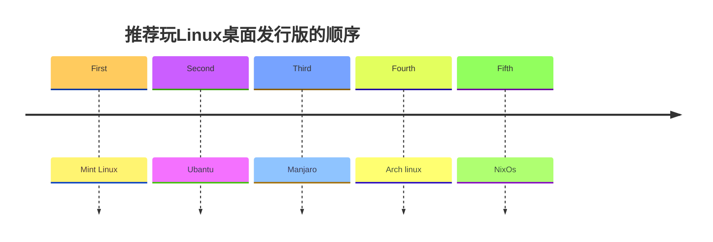

# 引言

在我最开始折腾Linux的时候，和所有习惯了Windows操作系统的人一样，完全不知道应该干什么，怎么操作，尤其在国内大学对于Linux系统教育之少的情况下，很多基础的知识都需要自己去上网慢慢重头开始接触学习。不能说这种方式不好，只是总感觉缺少了一些系统性，而且国内的博客教程确实良莠不齐，很多博主都是针对于某一单一的问题进行解决，很少会系统性的分析解决问题，然后我们就傻乎乎的按着步骤敲命令，不知其所以然。

看到这，你是不是在想，哦~，你要出一个系统性的全面的教程了吗，太好了~    
额 ~ 事实上 我确实这样想 ~ 过 ~
奈何一人之力比不上整个全球开源社区的智慧，而且也没必要，因此最好的学习方式还是根据官方文档去学习，碰到问题去官网并结合网上其他博客知识去查询解决，这里我只是根据自己的折腾经验推荐些折腾的思路，不一定适合所有人，当然肯定也会适合一些想折腾的朋友。

> [!tip]
> 对于大部分国人来说，网络问题以及那蹩脚的英语水平是学习Linux系统知识的最大门槛，而且这个门槛也不算低，需要不断地折腾。当然我也是这么过来的，因此你也可以的，善用网络去学习。

# 推荐玩Linux发行版本的顺序

像大多数刚接触到Linux的人一样，我最开始也是ubantu linux发行版，用虚拟机安装后去操作，用于一些课上作业和任务。
回想刚开始学习的体验，确实主要难度都在命令行，毫无了解，不过我对于它的界面也极其**水土不服**，后来我才知道那是gnome桌面的变种，很不习惯，而且说实话不咋符合我的审美，感觉有点丑。

后面当我不再有学习需要后，纯粹是好奇心驱动的时候，我转向了mint linux,  从这个mint linux 开始我才真正入门，有兴趣继续探索下去。

因此我推荐玩Linux桌面发行版的顺序如下：
先玩mint linux，它的桌面主题风格全是windows风格的，可以无缝衔接，区别不大，然后一点点使用积累经验。
之后再玩ubantu和ubantu的衍生版，看自己的喜欢，我觉得mint linux和ubantu的时间可以长一些，最少一年以上，然后再尝试arch linux为基础的manjaro 和 arch linux，这类高级Linux发行版本有很多需要自己的配置。
nixos又是另一种情况了，有更高级的迁移需求等等可以去探索。
mint linux 和 ubantu 都是 debian系列的，社区庞大而且deb软件包很容易下载安装，基本都有提供，因此慢慢熟悉后，把Linux的一些基本知识和操作弄明白后再切换到其他操作系统就容易了。
最起码你知道了Linux上的包管理器概念，如何安装卸载软件，以及一些基本命令，其他发行版虽然包管理器不一样，但是道理是一样的。

| 序号  | Linux 发行版  | 介绍                                                   | 支持的桌面风格主题                                                                       |
| --- | ---------- | ---------------------------------------------------- | ------------------------------------------------------------------------------- |
| 1   | Mint Linux | 基于 Ubuntu 的衍生版本，以简洁易用著称，适合新手，提供开箱即用的多媒体支持和友好的桌面环境。   | **Cinnamon**（默认）、MATE、Xfce，这些主题都是极其 windows风格的                                  |
| 2   | Ubuntu     | 基于 Debian 的流行发行版，强调易用性和稳定性，拥有庞大的社区支持和丰富的软件生态。        | **GNOME**（默认）、KDE Plasma（Kubuntu）、Xfce（Xubuntu）、MATE（Ubuntu MATE）、LXQt（Lubuntu） |
| 3   | Manjaro    | 基于 Arch Linux 的用户友好发行版，提供滚动更新与稳定性的平衡，支持 AUR 和多种桌面环境。 | **Xfce**（官方推荐）、KDE Plasma、GNOME（官方版本），社区提供 Budgie、Cinnamon、i3 等                 |
| 4   | Arch Linux | 面向高级用户的轻量级发行版，采用滚动更新模式，强调自定义化和“自己动手”理念，需手动配置系统。      | **无默认**，支持所有主流桌面（如 KDE、GNOME、Xfce、i3wm、Sway 等），需用户自行安装配置                        |
| 5   | NixOS      | 以声明式配置和可复现性为核心的发行版，通过 Nix 包管理器实现原子更新和依赖隔离，适合开发与运维场景。 | 支持 **GNOME、KDE Plasma、Xfce** 等，通过配置文件灵活启用                                       |

我并没有放 Fedora ,suse，red hat 等等商业版本，可能有人喜欢用Fedora，这都不打紧，看你自己感兴趣的程度，自我兴趣心驱动的探索行为才能使自己真正体会到学习的快乐。

那么下一阶段，如果你对基础命令等等都熟悉了，可以熟练使用这个操作系统，那我建议你可以安装一个双系统，并且把 Linux 系统作为主力系统去使用。

如果双系统也玩得比较完善，你甚至还可以拿 Linux 系统作为你的主力操作系统去工作。针对文档的兼容性也都有很多解决方案，office等等都是有相应软件的，wps也有Linux版本。
在 Linux 系统里边，有一个非常好的理念就是“一切皆文件”。那么你就会养成一种思维方式，就是一切都可以用文件的方式去解决。同时，它还有一种对应的哲学思想，就是以简洁为主，慢慢你就会培养出看到问题本质的能力。

我相信当你沉迷于linux系统后，你很难再去接受Windows系统的一些操作，你会感受到它的简洁、高效，没有广告，没有其他多余的东西，命令行可以批量解决很多重复的劳动，对系统资源最大化的利用，这些会节省你多少时间啊。

最后我要说，Linux不是适合所有人，也不是所有人一定就应该用Linux，当然我认为其从设计出来也并不是为所有人服务的。它本身就是推崇极客精神和黑客文化的这类人天然的土壤，追求自由和高度掌控是这类人的特点，我只是推荐你去尝试和学习，因为我认为这个过程体验很美妙，这个过程可以学习到很多设计的哲学思想，Linux本身隐含了很多计算机先贤们的思想和设计哲学，而这个是Windows系统无法带给你的，你直接接触到的东西都是用***软件即服务***思想包装好的东西，一个个软件隐藏了很多的步骤，而Linux至少，它的大门一直敞开着！